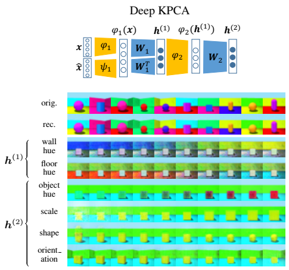

# Deep Kernel Principal Component Analysis for Multi-level Feature Learning



Deep KPCA is a deep kernel method to learn efficient and disentangled data representations in multiple levels, with forward and backward dependency across levels.

## Abstract
Principal Component Analysis (PCA) and its nonlinear extension Kernel PCA (KPCA) are widely used across science and industry for data analysis and dimensionality reduction. Modern deep learning tools have achieved great empirical success, but a framework for deep principal component analysis is still lacking. Here we develop a deep kernel PCA methodology (DKPCA) to extract multiple levels of the most informative components of the data. Our scheme can effectively identify new hierarchical variables, called deep principal components, capturing the main characteristics of high-dimensional data through a simple and interpretable numerical optimization. We couple the principal components of multiple KPCA levels, theoretically showing that DKPCA creates both forward and backward dependency across levels, which has not been explored in kernel methods and yet is crucial to extract more informative features. Various experimental evaluations on multiple data types show that DKPCA finds more efficient and disentangled representations with higher explained variance in fewer principal components, compared to the shallow KPCA. We demonstrate that our method allows for effective hierarchical data exploration, with the ability to separate the key generative factors of the input data both for large datasets and when few training samples are available. Overall, DKPCA can facilitate the extraction of useful patterns from high-dimensional data by learning more informative features organized in different levels, giving diversified aspects to explore the variation factors in the data, while maintaining a simple mathematical formulation.

## Code Structure

- Training and evaluation of a DKPCA model is done in `train*.py` from the `main`.
  - Training a two-level DKPCA with nonlinear first level and linear second level is done in `train_lin.py`.
  - Training DKPCA with RBF kernel in both two levels is done in `train_nl.py`. The four RBF levels experiments are done with `train_nl4.py`. 
  - Training DKPCA with explicit feature maps is done in `train_cnn.py`.
- Disentanglement evaluation is done in `gen.py` (latent traversal plots) and in `eval_irs.py` (quantitative evaluation).
- Available kernels are in `kernels.py`. 
- Available explicit feature maps (both encoder and decoder) are in `train_cnn.py`. 
- Employed datasets are in `dataloader.py`.

## Installation
### Download
First, navigate to the unzipped directory and install required python packages with the provided `requirements.txt` file. This is explained in the following section.

### Install packages in conda environment
Run the following in terminal. This will create a conda environment named *rkm_env*.

```
conda create --name rkm_env python=3.10
```

Activate the conda environment with the command `conda activate rkm_env`. To install the required dependencies, run:

```
pip install -r requirements.txt
```

## Training

Activate the conda environment by `conda activate rkm_env` and run one of the following commands, for example:
```
python train_lin.py dataset=multivariatenormal levels=j2_linear levels.j1.s=2 levels.j2.s=2
python train_nl.py dataset=3dshapes dataset.N=100 levels=j2_rbf
python train_cnn.py dataset=3dshapes dataset.N=1000 levels=j2_cnn_lin optimizer=geoopt optimizer.maxepochs=10
```
The configuration is done using YAML files with [hydra](https://hydra.cc/). Available configurations are in the `configs` directory. You may edit the provided YAML files or write your own files. Alternatively, you can change configurations directly from the command line, e.g,.:

```
python train_lin.py levels.j2.s=5
```

## Using DKPCA on your data
This can be done in `dataloader.py`.
To add a new dataset, define a new `get_dataset_dataloader` function returning the pytorch dataloader. Then, add that dataset to the `get_dataloader_helper` function.

## Using DKPCA with your kernel
This can be done in `kernels.py`.
To add a new kernel, define a new pytorch module, similar to, e.g., `GaussianKernelTorch`. Then, add that kernel to the `kernel_factory` function.

## Using DKPCA on benchmark datasets
To run DKPCA with two RBF levels on the synthetic dataset Synth 2 with 30 components in each level, open a terminal in the main directory and run
```
cd <maindirectoryname>
python train_nl.py dataset=complex6 dataset.N=100 levels=j2_rbf levels.j1.s=30 levels.j2.s=30 optimizer=pg optimizer.maxepochs=5000 levels.j2.eta=1 optimizer.torch.lr=0.01
```

The training and the evaluation are shown on screen. The model is saved in `$HOME/out/deepkpca` for future use.

To run DKPCA on the real-world datasets MNIST/3dshapes/Cars3d/SmallNORB, you may use a similar command structure. For example, to train DKPCA with two RBF levels on a subset of 3dshapes
```
cd <maindirectoryname>
python train_nl.py dataset=3dshapes dataset.N=50 levels=j2_rbf levels.j1.s=30 levels.j1.kernel.args.sigma2=100 levels.j2.s=30 levels.j2.kernel.args.sigma2=1 optimizer=pg optimizer.torch.lr=0.01 optimizer.maxepochs=5000
```
The employed benchmark datasets are downloaded in `$HOME/data`. Their availability is described in the `dataloader.py` file. 

## Evaluating disentanglement
In this section, we explain how to evaluate the disentanglement performance of DKPCA, both qualitatively with latent traversals and quantitatively with disentanglement metrics. We also describe how to run the compared deep learning methods.

### Generating latent traversals
After training a DKPCA model, the model weights are saved in `$HOME/out/deepkpca/<model_label>`, i.e., a label is associated with every trained model. The traversals along the deep principal components, as well as the reconstructions, are then performed in `gen.py` from the given pre-trained model label. For instance, if the model label is `3pp8rxvi`, the generation is done by running:
```
python gen.py --model 3pp8rxvi
```
The generated images are saved in the `Traversal_imgs` directory.
The arguments of the `main` also specify the number of steps in the traversals and the variance of the Gaussian distribution from which the new vectors of hidden features are sampled from the latent space. 

### Quantitative disentanglement evaluation
Computation of the IRS metric is done in `eval_irs.py`. For instance, if the trained model label is `3pp8rxvi`, the quantitative disentanglement evaluation is done by running:
```
python eval_irs.py --model 3pp8rxvi --n 1000
```
The command line argument `--n` specifies the number of samples to use for evaluation.

Before running `eval_irs.py`, the employed [disent](https://github.com/nmichlo/disent) library needs to be updated to compute the IRS metric and to handle subsampling with an additional optional `available_y` argument to the `StateSpace.sample_factors` method. To do this, copy the files in the provided `disent_irs` directory to the directory of the disent library. For instance, if conda was installed in your home directory
```
cp -r disent_irs/* ~/miniconda3/envs/rkm_env/lib/python3.10/site-packages/disent/
```

The python script `eval_irs.py` can also be used in the same way to evaluate VAE-based models trained using the disentanglement_lib library for the compared deep learning methods (see next section for details). For that library, Tensorflow is an additional dependency to be installed.


### Compared deep learning methods
The VAE-based methods beta-VAE, FactorVAE, and beta-TCVAE were trained with the [disentanglement_lib](https://github.com/google-research/disentanglement_lib) library for both the small- and large-scale experiments. For the Cars3D large-scale quantitative comparison and for the latent traversals, the pre-trained models are obtained following [disentanglement_lib documentation](https://github.com/google-research/disentanglement_lib#pretrained-disentanglement_lib-modules).

## Verify Deep Approximation Bounds lemma numerically
To verify the deep approximation lower and upper bounds numerically, run
```
python train_lin.py optimizer.maxepochs=10000 levels=j2_rbf_lin dataset.N=10 levels.j1.s=10 levels.j2.s=10 bounds=true
```

## Available configurations
The following options for training a DKPCA model are available:

```
$ python train_lin.py --help
train_lin is powered by Hydra.

== Configuration groups ==
Compose your configuration from those groups (group=option)

dataset: 3dshapes, cars3d, cholesterol, complex6, diabetes, ionosphere, liver, mnist, multivariatenormal, norb, square, yacht
levels: j2_cnn_lin, j2_linear, j2_rbf, j2_rbf_lin, j4_rbf
model: rkm
optimizer: adam, geoopt, pg


== Config ==
Override anything in the config (foo.bar=value)

seed: 0
saved_model: null
ae_weight: null
bounds: false
dataset:
  name: square
  'N': 100
  mb_size: 64
  Ntest: -1
  shuffle: false
  workers: 0
  post_transformations: []
  pre_transformations: []
  val_perc: 0
  std: 0.05
levels:
  j1:
    lambd: 1.0
    eta: 1.0
    s: 2
    kernel:
      name: linear
      args: null
  j2:
    lambd: 1.0
    eta: 1.0
    s: 2
    kernel:
      name: linear
      args: null
optimizer:
  name: pg
  torch:
    lr: 0.01
  init:
    name: random
  maxepochs: 1000
  epsilon: 0.001
  beta: 1.0e-07
  patience: 1000
model:
  name: rkm
  svdopt: true


Powered by Hydra (https://hydra.cc)
Use --hydra-help to view Hydra specific help
```
